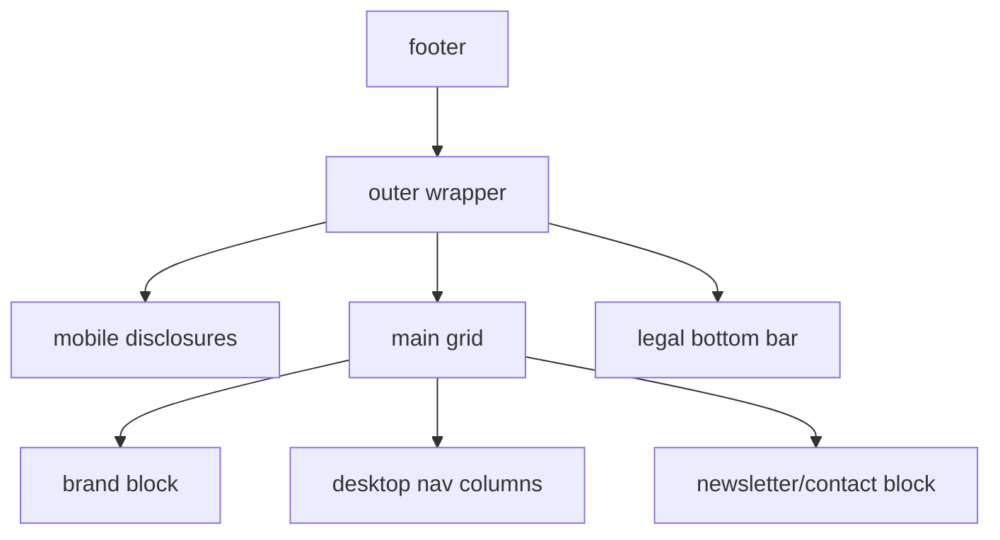

# Footer Responsive — Structure Map & Audit

## Architecture

`App.jsx` renders `Footer` after the public `main` for `home`, `gallery`, `detail`, `checkout`, `my-orders`, and `shop`.

`Footer.jsx` is normal document flow:

## Anchoring

- Footer: flow, `position: relative`, no fixed or absolute layout dependency.
- Mobile disclosures: flow. Their bottom border directly affected the visual spacing before the brand block.
- Main grid: flow. Breakpoint choice controls whether siblings share one column, two columns, or five columns.
- Newsletter contact: flow inside the grid. Width and `min-w-0` decide whether email/address text can wrap correctly.

## Issue Found

- The five-column desktop grid started at `md` (768px), but the newsletter column needed more room than available. At 768px, the newsletter measured `right: 858` for a `768px` viewport.
- On mobile, the disclosure group had no bottom spacing, so the last legal divider touched the brand block.
- At laptop width, the newsletter column was only about `270px`, forcing harsh email wrapping.

## Corrections Applied

- Desktop five-column grid now starts at `xl` instead of `md`.
- `lg` uses a two-column intermediate layout: brand + newsletter, while disclosures stay available above.
- Mobile disclosures now have a stable `mb-10`, measured as a 40px gap before the brand block.
- Newsletter/contact block has `min-w-0`, controlled max widths, and wrapped text spans for email/address.
- Bottom legal bar uses a three-zone grid from `lg` upward and wraps links safely below that.

## Validation

Checked with Playwright on `/?page=gallery`:

| Viewport | Result |
| --- | --- |
| 390x844 | No horizontal overflow, 40px disclosure-to-brand gap |
| 768x900 | No horizontal overflow, stacked brand/newsletter |
| 1024x768 | No horizontal overflow, two-column compact layout |
| 1280x800 | No horizontal overflow, five-column laptop layout |
| 1440x900 | No horizontal overflow, five-column desktop layout |

