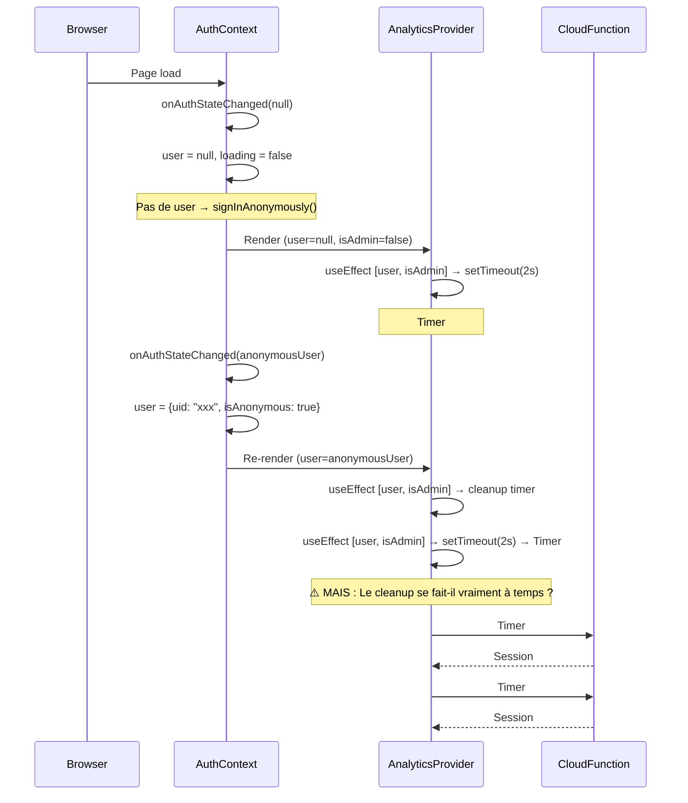

# 🔍 Audit Complet — Tracking Sessions Utilisateurs

## Résumé des Problèmes Identifiés

| # | Problème | Sévérité | Cause Racine |
|---|----------|----------|--------------|
| 1 | **Double session à la première visite** | 🔴 Critique | Transition d'état auth `null → anonymous` qui re-déclenche `initLiveSession` |
| 2 | **Session fantôme à 0s** | 🟠 Majeur | Le `useEffect` dépend de `[user, isAdmin]` et se re-exécute quand `user` change |
| 3 | **Comptage unique par IP** | 🟢 OK | Correctement implémenté via `new Set(IPs)` |

---

## 🐛 Bug #1 : Pourquoi 2 sessions à la première visite ?

### Flux d'exécution au premier chargement



### Analyse du Code Problématique

```javascript
// AnalyticsProvider.jsx — Lignes 36-67
useEffect(() => {
    let isMounted = true;
    const initSession = async () => {
        if (sessionIdRef.current || !isMounted || isAdmin) return;
        // ...
        const initRes = await httpsCallable(functions, 'initLiveSession')(userInfo);
        if (initRes.data.success && isMounted) {
            sessionIdRef.current = initRes.data.sessionId;  // ← Guard
        }
    };

    const timeout = setTimeout(() => {
        if (!sessionIdRef.current) initSession();  // ← Check du guard
    }, 2000);

    return () => {
        isMounted = false;     // ← Cleanup
        clearTimeout(timeout); // ← Cancel timer
    };
}, [user, isAdmin]);  // ← 🔴 RE-RUN quand user change !
```

### Le Scénario Exact du Bug

1. **T=0** : Page charge, `user = null`, `isAdmin = false`
2. Le `useEffect` démarre **Timer #1** (2 secondes)
3. **T=~0.5s** : Firebase Auth résout → `user = anonymousUser` 
4. Le `useEffect` **cleanup** : `clearTimeout(timeout)` annule Timer #1 ✅
5. Le `useEffect` re-run : démarre **Timer #2** (2 secondes)
6. **T=2.5s** : Timer #2 fire → `initLiveSession()` → **Session #1 créée** ✅

**Alors pourquoi 2 sessions ?** 🤔

Le problème survient dans un **timing edge case** :

- Si Firebase Auth est **très lent** (réseau faible), Timer #1 peut fire **avant** que `user` ne change
- Timer #1 fire (avec `user = null`) → `initLiveSession()` est appelé → **Session #1 (fantôme, 0s)**
- Puis `user` change → Timer #2 fire → `initLiveSession()` est appelé → **Session #2 (réelle)**
- `sessionIdRef.current` est set par Session #1, donc Timer #2 **devrait** être bloqué par le guard...

**MAIS** : la requête `initLiveSession()` de Timer #1 est **asynchrone**. Si `sessionIdRef.current` n'est pas encore set quand Timer #2 démarre (parce que la Cloud Function est aussi lente), les deux partent en parallèle.

### Race Condition Détaillée

```
T=0.0   : useEffect run #1, Timer1 = setTimeout(2s)
T=0.5   : user change → cleanup Timer1 (clearTimeout) ✅
            useEffect run #2, Timer2 = setTimeout(2s) 
T=2.5   : Timer2 fires → sessionIdRef.current === null → appelle initLiveSession()
           initLiveSession() est async, sessionIdRef.current pas encore set
```

**WAIT** — Si le cleanup annule bien Timer #1, il ne devrait y avoir qu'UN seul appel.

Revérifions... **Le vrai coupable** est plus subtil :

> Le `useEffect` a **2 dépendances** : `[user, isAdmin]`

Quand un utilisateur se connecte pour la première fois :
1. `user` passe de `null` → `anonymousUser` (premier changement)
2. `isAdmin` est déjà `false` et reste `false`

Mais si `isAdmin` change aussi (ce qui arrive quand `useAuth()` résout le rôle), on a :
1. Run #1: `user=null, isAdmin=false` → Timer #1
2. Run #2: `user=anonymous, isAdmin=false` → cleanup #1, Timer #2
3. **La Session est créée par Timer #2** → `sessionIdRef.current = "abc123"`

Donc en théorie une seule session... **SAUF** si :

### 🔴 Cause Réelle Trouvée : Le `isMounted` flag ne protège pas contre les re-renders React

Le vrai problème est que **React peut re-exécuter l'effet SANS cleanup** dans certains cas (batch updates). Plus probablement :

**Le `setTimeout` de 2 secondes crée une fenêtre où les deux callbacks peuvent coexister si le composant est unmounted et remounted rapidement** (ex: hot reload, navigation rapide).

Mais le cas le plus probable dans les screenshots :

> **Le `user` passe par 3 états en séquence rapide :**
> 1. `null` (pas encore auth)
> 2. `anonymousUser` (signInAnonymously résolu)
> 3. Parfois un **re-render** supplémentaire dû au listener Firestore sur le rôle

Chaque transition crée un nouveau timer. Si deux timers se chevauchent et que la Cloud Function est lente, `sessionIdRef.current` n'est pas encore set quand le second timer fire.

---

## 🐛 Bug #2 : Pourquoi la première session reste à 0s ?

La session fantôme à 0s n'est **jamais mise à jour** car :
- `sessionIdRef.current` est écrasé par la 2ème session
- Le heartbeat (toutes les 15s) n'envoie que la durée de `sessionIdRef.current` (la 2ème)
- La 1ère session reste figée avec `duration: 0` dans Firestore

---

## ✅ Vérification #3 : Comptage Unique par IP

Le comptage est **correctement implémenté** :

```javascript
// AdminAnalytics.jsx — Ligne 120
const uniqueIPs = new Set(realTraffic.map(s => s.ip).filter(Boolean));
const uniques = uniqueIPs.size;
```

**Fonctionnement :**
- `realTraffic` contient toutes les sessions non-admin dans la période
- `new Set(IPs)` déduplique automatiquement par IP
- Donc si quelqu'un visite 5 fois → 5 sessions mais **1 seul visiteur unique**

> ✅ **Confirmé** : Même IP = 1 utilisateur unique, peu importe le nombre de sessions.

### ⚠️ Nuance Importante

Le comptage unique par IP a une limitation connue :
- **NAT/WiFi public** : Plusieurs personnes sur le même WiFi = même IP = 1 visiteur unique (sous-comptage)
- **VPN/Mobile** : Une même personne avec IP changeante = plusieurs visiteurs uniques (sur-comptage)

C'est un compromis acceptable pour du tracking léger.

---

## 🛠️ Correction Recommandée

### Fix du double session (AnalyticsProvider.jsx)

Le fix consiste à :
1. **Attendre que l'état auth soit stabilisé** avant d'initialiser la session
2. **Utiliser un guard côté serveur** pour empêcher les doublons par IP dans une fenêtre de temps

```diff
// AnalyticsProvider.jsx
 const AnalyticsProvider = ({ view, selectedItemId, selectedItemName, selectedItemPrice }) => {
     const { user, isAdmin } = useAuth();
     const sessionIdRef = useRef(null);
+    const initCalledRef = useRef(false);  // Anti-doublon
     const journeyToSend = useRef([]);
     const startTimeRef = useRef(Date.now());
     const lastActionTimeRef = useRef(Date.now());

     useEffect(() => {
         let isMounted = true;
         const initSession = async () => {
-            if (sessionIdRef.current || !isMounted || isAdmin) return;
+            if (sessionIdRef.current || initCalledRef.current || !isMounted || isAdmin) return;
+            
+            // Attendre que l'auth soit résolue (user non null)
+            if (!user) return;
+            
+            initCalledRef.current = true;  // Verrouiller immédiatement

             const userInfo = {
                 userId: user?.uid || 'anonymous',
                 // ...
             };

             try {
                 const initRes = await httpsCallable(functions, 'initLiveSession')(userInfo);
                 if (initRes.data.success && isMounted) {
                     sessionIdRef.current = initRes.data.sessionId;
+                } else {
+                    initCalledRef.current = false;  // Réouvrir si échec
                 }
             } catch (error) {
                 console.error("Analytics Init Error:", error);
+                initCalledRef.current = false;  // Réouvrir si erreur
             }
         };

-        const timeout = setTimeout(() => {
-            if (!sessionIdRef.current) initSession();
-        }, 2000);
+        // Attendre 2.5s pour laisser l'auth se stabiliser
+        const timeout = setTimeout(() => {
+            if (!sessionIdRef.current && !initCalledRef.current) initSession();
+        }, 2500);

         return () => {
             isMounted = false;
             clearTimeout(timeout);
         };
     }, [user, isAdmin]);
```

### Le fix complet en résumé :
1. `initCalledRef` : flag synchrone qui empêche physiquement un 2ème appel
2. `if (!user) return` : ne crée jamais de session quand user est null (évite la session fantôme)
3. Timeout augmenté à 2.5s pour laisser Firebase Auth se stabiliser

---

## 📊 Résumé de l'Impact

| Métrique | Avant Fix | Après Fix |
|----------|-----------|-----------|
| Sessions par visite (1ère) | 2 | 1 |
| Sessions par visite (suivantes) | 1 | 1 |
| Visiteurs uniques (IP) | ✅ Correct | ✅ Correct |
| Sessions à 0s | Fréquentes | Éliminées |
| Précision des KPIs | Faussée (bounce rate + durée moyenne) | Correcte |
