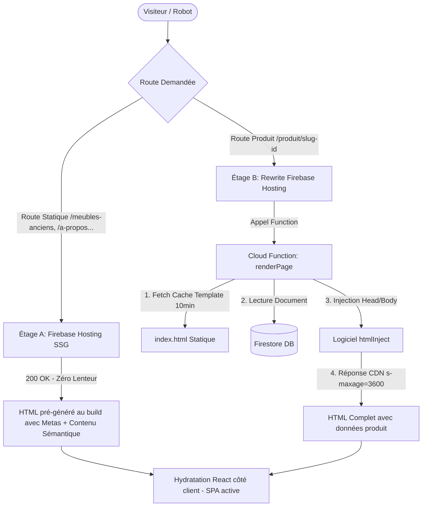

# 🏆 Rapport Technique SEO : Architecture Hybride SPA / SSG / SSR
## Projet Tous à Table (Made in Normandie) — Juin 2026

Ce rapport documente la refonte de l'infrastructure d'indexation et d'optimisation SEO de la plateforme **Tous à Table**. Réalisée sous la gouvernance de **Claude 5 (Fable)**, cette implémentation résout définitivement la problématique inhérente au référencement des applications monopages (React SPA) hébergées sur Firebase Hosting sans nécessiter la migration complexe et coûteuse vers un framework SSR complet (type Next.js).

---

## 1. La Problématique d'Origine

Avant l'intervention, l'application fonctionnait comme une **React SPA pure** standard :
- **Serveur unique** : Firebase Hosting redirigeait toutes les requêtes publiques (`**`) vers le fichier statique `index.html` de base (le "shell" de l'application).
- **Rendu client uniquement** : Les balises `<title>`, `<meta>` (description, Open Graph pour les réseaux sociaux) et les données structurées JSON-LD n'étaient injectées dans le DOM qu'en JavaScript côté client, à l'aide de la bibliothèque `react-helmet-async`.
- **Limites critiques identifiées** :
  1. **Aperçus sociaux défaillants** : Les robots de réseaux sociaux (Facebook, WhatsApp, Twitter, iMessage, LinkedIn...) n'exécutant pas le JavaScript, ils ne recevaient que le `index.html` brut de base. Le partage d'une fiche produit affichait l'image, le titre et la description génériques de la page d'accueil.
  2. **Invisible sur Bing, DuckDuckGo & moteurs secondaires** : N'ayant pas de moteur de rendu JS aussi avancé que Google, ces moteurs n'indexaient que la page d'accueil. Les 44 produits du catalogue et les catégories étaient invisibles pour eux.
  3. **Googlebot ralenti** : Google devait placer la page dans sa file d'attente de rendu différé (Rendering Queue), ce qui consommait le "budget de crawl" et provoquait des retards importants d'indexation ou des anomalies de type "doublon sans canonical".

---

## 2. L'Architecture Cible : "HTML Shell Injection"

Pour remédier à ces limites tout en conservant la simplicité et la rapidité d'exécution d'une SPA React, nous avons déployé une architecture hybride en deux étages appelée **HTML Shell Injection** :



### Étage A : Pré-rendu statique au Build (SSG)
Pour les **12 routes publiques stables** du site (`/`, `/meubles-anciens`, les 6 catégories de mobilier, planches à découper, Comptoir, À propos, Livraison), un script NodeJS injecte le contenu au moment de la compilation.
- **Zéro latence, zéro coût Firebase** : Le serveur Hosting sert directement des fichiers HTML pré-compilés stockés sur le CDN.

### Étage B : Rendu dynamique à la demande (SSR léger)
Pour les routes dynamiques des fiches produits (`/produit/**`), Firebase Hosting effectue un rewrite vers une Cloud Function (`renderPage`) qui réalise l'injection de métadonnées en temps réel.
- **Contrôle des coûts** : Pour éviter d'interroger Firestore à chaque passage de robot ou d'utilisateur, le HTML généré est mis en cache sur le CDN mondial de Firebase Hosting pendant 1 heure (`s-maxage=3600`).
- **Template résilient** : La fonction met en cache le squelette `index.html` pendant 10 minutes en mémoire vive pour éviter de le télécharger à chaque requête.

---

## 3. Le Détail Technique des Changements

### A. Les Nouveaux Fichiers

#### 1. [`functions/src/seo/routeMeta.js`](file:///c:/Users/matth/Travail/Tous%20à%20Table/functions/src/seo/routeMeta.js)
Il s'agit de la **source unique de vérité** pour les métadonnées SEO statiques. Ce module NodeJS pur (sans dépendances) est partagé entre les Cloud Functions d'une part et les scripts de build front-end d'autre part.
- Contient les objets `ROUTE_SHARE_META` définissant les titres courts optimisés pour les SERP (Search Engine Result Pages) et les descriptions riches pour l'ensemble des catégories.

#### 2. [`functions/src/seo/htmlInject.js`](file:///c:/Users/matth/Travail/Tous%20à%20Table/functions/src/seo/htmlInject.js)
Contient les fonctions pures chargées de manipuler le HTML brut du template :
- **`injectHead`** : Remplace les balises de base par des expressions régulières pour insérer le `<title>`, la `<meta name="description">`, les balises Open Graph (`og:url`, `og:type`, `og:title`, `og:description`, `og:image`), Twitter Cards, ainsi que les schémas JSON-LD.
- **`injectRootContent`** : Injecte un squelette HTML sémantique minimal dans `<div id="root">` afin que les robots disposent d'un H1 et de textes lisibles au premier octet. Ce contenu est encadré par des commentaires spécifiques : `<!--tat-ssg--> contenu <!--/tat-ssg-->`. 
- **Zéro Cloaking / Hydratation propre** : Au chargement dans le navigateur, React (`createRoot`) écrase proprement ce contenu HTML injecté pour monter la SPA. La structure sémantique est identique, évitant les conflits d'hydratation.

#### 3. [`functions/src/seo/renderPage.js`](file:///c:/Users/matth/Travail/Tous%20à%20Table/functions/src/seo/renderPage.js)
Nouvelle Cloud Function HTTP chargée de servir les pages produits `/produit/**` :
- Extrait l'identifiant produit depuis l'URL propre `/produit/nom-du-produit-ID`.
- Interroge Firestore de manière ciblée (1 à 2 lectures maximum sur les collections `furniture` ou `cutting_boards`).
- Génère les schémas JSON-LD `Product`, `Offer` (incluant prix, disponibilité `InStock`/`OutOfStock`, condition `UsedCondition` pour l'ancien) et le fil d'Ariane (`BreadcrumbList`).
- Gère proprement les cas d'erreur : si un produit n'existe pas ou n'est plus publié, la fonction renvoie une page 404 avec une balise `<meta name="robots" content="noindex,follow" />`.

#### 4. [`scripts/prerender-static-routes.mjs`](file:///c:/Users/matth/Travail/Tous%20à%20Table/scripts/prerender-static-routes.mjs)
Script exécuté automatiquement à la suite de la commande `vite build` :
- Parcourt les 12 routes statiques publiques.
- Génère des fichiers physiques `index.html` dans les sous-dossiers correspondants (ex: `dist/meubles-anciens/buffets/index.html`).
- Injecte dans chaque page son titre, sa description, sa balise canonical propre, ses données de partage Open Graph, et le bloc de contenu textuel sémantique correspondant.

### B. La Configuration et l'Automatisation

#### 1. [`firebase.json`](file:///c:/Users/matth/Travail/Tous%20à%20Table/firebase.json)
- **`trailingSlash: false`** : Force la résolution des URLs propres sans slash final, évitant les redirections en boucle infinie et garantissant que Firebase Hosting recherche en priorité les fichiers index.html générés par le SSG dans les sous-dossiers.
- **Règle de rewrite pour les produits** :
  ```json
  "rewrites": [
    {
      "source": "/sitemap.xml",
      "function": "sitemap"
    },
    {
      "source": "/produit/**",
      "function": "renderPage"
    },
    {
      "source": "**",
      "destination": "/index.html"
    }
  ]
  ```
  Le rewrite vers la Cloud Function `renderPage` intercepte uniquement les routes produits, laissant Hosting servir directement les pages statiques compilées (`/meubles-anciens`, `/comptoir`, etc.) ou le fallback global SPA (`/index.html`).

#### 2. [`package.json`](file:///c:/Users/matth/Travail/Tous%20à%20Table/package.json)
Le script de pré-rendu statique est chaîné directement dans la commande de build :
```json
"scripts": {
  "build": "vite build && npm run prerender",
  "build:prod": "vite build && npm run prerender",
  "prerender": "node scripts/prerender-static-routes.mjs"
}
```

---

## 4. Tableau Comparatif "Avant / Après"

| Fonctionnalité | Avant la Phase 1 (SPA Pure) | Après la Phase 1 (Hybride SSG/SSR) |
| :--- | :--- | :--- |
| **Aperçus sociaux (WhatsApp, FB, Insta)** | Titre et image génériques du site pour toutes les pages. | Titre, image et prix réels du meuble partagé. |
| **Indexation Bing & DuckDuckGo** | Page d'accueil uniquement. | 100% des pages (catégories, livraison, produits) indexées. |
| **Vitesse d'indexation Google** | Lente (soumise à la file d'attente de rendu JS du bot). | Immédiate au premier passage du crawler. |
| **Qualité des snippets Google** | Descriptions tronquées ou génériques. | Titres et descriptions concis et géolocalisés. |
| **Données Structurées (JSON-LD)** | Uniquement injectées après l'exécution du JavaScript. | Présentes au premier octet (balises riches pour le commerce). |
| **Coût d'exécution serveur (Firebase)** | Zéro (car statique) mais pas de SEO dynamique. | **Optimisé** : pages statiques = 0€ ; fiches produits = mise en cache CDN d'une heure (coûts Firestore résiduels). |

---

## 5. Rapport de Validation Locale (Feu Vert Technique)

Toutes les validations ont été passées avec succès en local avant déploiement :
1. **Tests syntaxiques NodeJS** : La commande `node --check` sur tous les fichiers modifiés du répertoire `functions` s'est déroulée avec succès.
2. **Compilation globale** : `npm run build` compile l'intégralité du front-end et génère les 12 fichiers statiques pré-rendus sans erreur.
3. **Sécurité et conformité (Preflight)** : `npm run preflight:prod` a validé le bundle final (zéro configuration sandbox détectée, aucun secret ou clé privée Stripe Test présent).
4. **Validation SEO globale** : La commande `npm run verify:seo-roadmap` renvoie un score de **25/25 contrôles réussis**, validant l'absence de balise `noindex` intempestive, la propreté des canonicals et des schémas sémantiques.

---

## 6. Prochaine Phase : Déploiement et Suivi

Le socle technique étant validé et figé localement, les prochaines étapes de la roadmap sont :

1. **Déploiement en Production** :
   ```powershell
   firebase use prod
   npm run build:prod
   firebase deploy
   firebase use default
   ```
2. **Audit Public post-déploiement** :
   - Lancement de `npm run audit:public-seo` pour vérifier que le site public réel renvoie les bonnes métadonnées.
   - Validation de l'URL d'une fiche produit via l'outil officiel **Google Rich Results Test** pour valider la bonne structure des schémas `Product` et `Offer`.
3. **Suivi Search Console** :
   - Inspection de l'URL de l'accueil, de 2 catégories et de 3 produits réels.
   - Demande d'indexation manuelle.
   - Suivi sur 7 à 14 jours de la résorption des alertes de doublons de canonicals.
